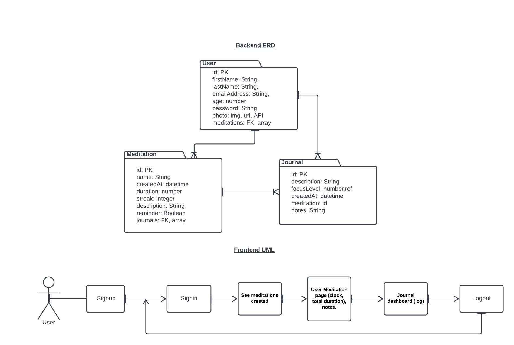
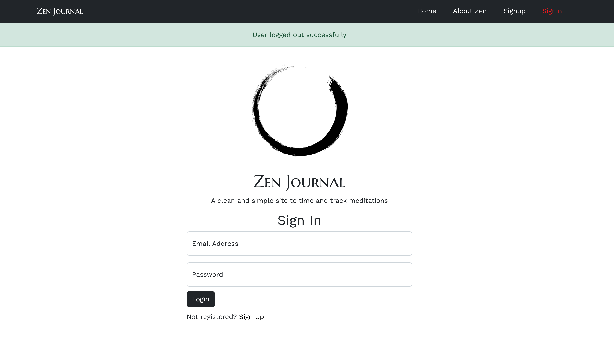
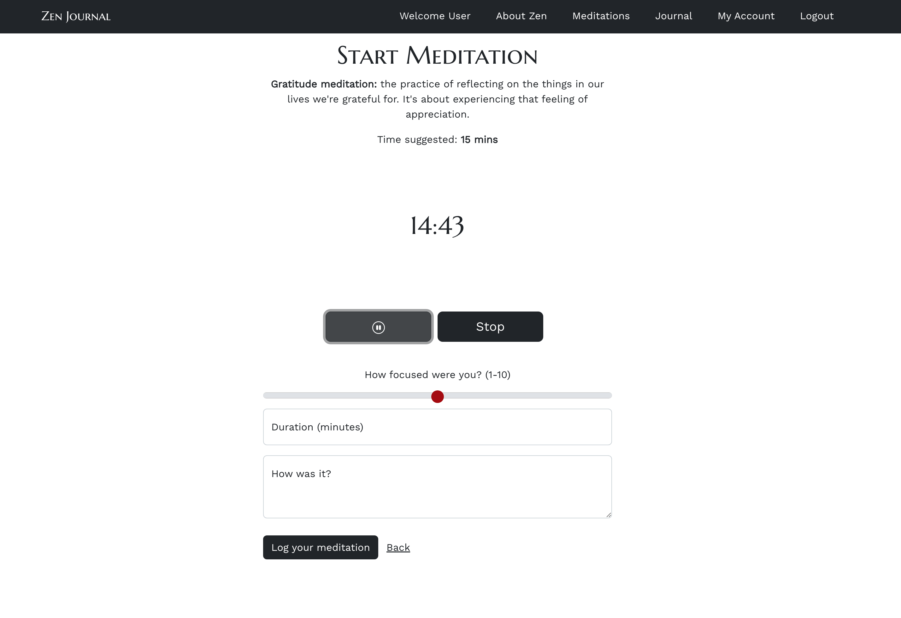
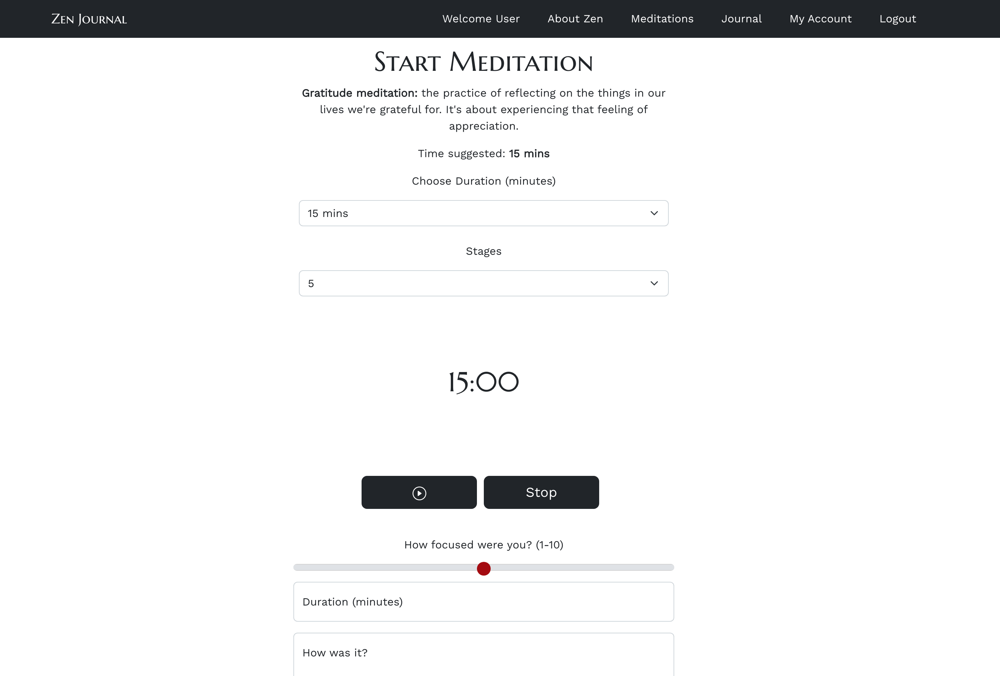
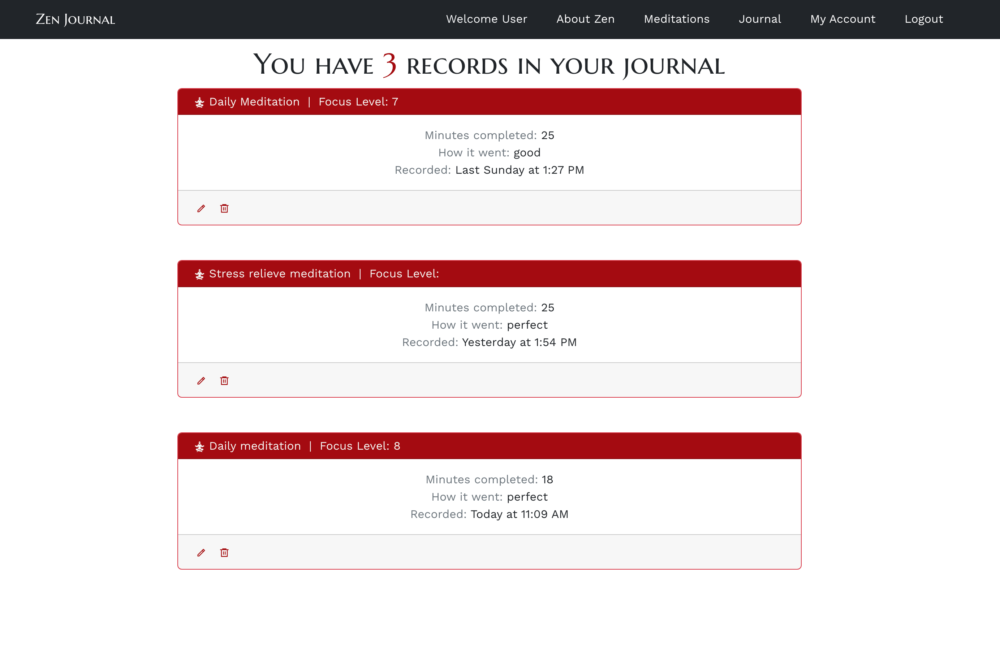

# 🧘‍♀️ Zen Journal App


## 👋 README by ***Yamily Benigni*** - [Linkedin](https://www.linkedin.com/in/yamilybenigni/) | [Portfolio](https://yamilycodes.com)

***

### 📝 Project philosophy
A clean and simple app to time and track meditations. We designed the app with two principal philosophies. Firstly, that journaling is an extremely powerful tool on the spiritual path. Not only does journaling allow us to become more aware of the content of our minds but it gives us a sense of our progress and prevents from sitting in rumination rather than actually meditating. 

Secondly, that most mediation apps do too much; they are filled with excessive guidance, gadgets, and gizmos and ultimately become a distraction themselves. In our design we try not to get in the way but simply allow the user to meditate, then write about what they experience.

***

### 🎯 Technical requirements
A working full-stack, single-page application hosted on Heroku.
- Incorporate the technologies of the MERN-stack:
    - MongoDB/Mongoose
    - Express
    - React
    - Node
- Have a well-styled interactive front-end.
- Communicates with the Express backend via AJAX.
- Implement token-based authentication. Including the ability of a user to sign-up, log in & log out.
- Implement authorization by restricting CRUD data functionality to authenticated users. Also, navigation should respond to the login status of the user.
- Have a well-scoped feature-set. Full-CRUD data operations are not required if one or more of the following are included:
- Consume data from a third-party API.
- Implement additional functionality if the user is an admin.
- Utilise multi-user, real-time communications.

***

### 💡 Concept idea
#### Tracking idea


#### Signup idea


#### ERD and UML models


***

### 🤔 User stories
* As a user I want to...
    - Create an account, login, logout;
    - Change my password;
    - Log my meditation technique;
    - Log my journey, day and time;
    - Track my time spending meditating;
    - See my journey (timeline);
    - Create personalised meditation;
    - Edit/update personalised meditation;
    - Delete personalised meditation.

***

### 📈 Development process
Project time scale - 2 weeks (working Monday to Friday normal business hours).

In the first meeting I discussed some ideas with the team and finally we decided on building an app for tracking meditations since we all meditated. The development was broken down into smaller modules which made it easier for the team to implement the taska. The tasks were divided into authentication, back-end, front-end development. During that meeting the team also decided that I would be the team leader as I had more experience in planning and resolving conflicts.

The next meeting included the creation of user stories, ERD and wireframes. I created a project board on Trello and we logged our allocated tasks where I could see what we were currently working on, and which tasks had been completed.

The app consists of two separate apps - an ExpressJS backend and a ReactJS frontend. They are linked via REST API.

Styling of the React frontend was achieved with React Bootstrap.

The development was test-driven, with each team member testing codes they had written and the team coming together to fix any bugs.

Git commits were made during the day and I would merge the codes, with the rest of the team pulling the merged code each morning just after our daily standup, so that we all have the same version of the app on our local development systems.

Final testing and deployment on Heroku was done on day 9 with a presentation and demonstration on day 10.

Screenshot from the Trello board. 


***

### 💻 Communication with team
The communication happened using ***Zoom***, ***Slack***, ***Trello*** board and ***Git*** for the version control.

***

### 👩‍💻 Technologies used
* This project is divided into backend and frontend development where the two connect via RESTful APIs. 
  - For the backend, it uses [Express](https://expressjs.com/), Node and [Mongoose](https://github.com/Automattic/mongoose#readme).
  - For the frontend, it uses [React JS](https://github.com/facebook/create-react-app).
* For the database, the app used [MongoDB](https://www.mongodb.com/), a cross-platform document-oriented database program. Classified as a NoSQL database program, MongoDB uses JSON-like documents with schema. 
* For authentication, the app used [JWT Auth](https://jwt.io/introduction) and [bcrypt](https://www.npmjs.com/package/bcrypt), a library to help hash passwords.
* For the styling, the project uses the [React Bootstrap](https://react-bootstrap.netlify.app/getting-started/introduction).
* As a team, we have used [GitHub](https://github.com/enterprise) for version control.
* And the app has been deployed on Heroku.


**Backend dependencies**: Bcrypt, Cors, dotenv, jsonwebtoken.
**Frontend dependencies**: Axios, jwt-decode, md5, [moment](https://momentjs.com/), [React icons](https://react-icons.github.io/react-icons).
**Third-party APIs**: [ZenQuotes](https://zenquotes.io/), [Gravatar](https://en.gravatar.com/site/implement/).
**Dev Tools**: VS code, Google font [Marcellus SC](https://fonts.google.com/specimen/Marcellus+SC), Pixabay royalty free images and [Flaticon](https://www.flaticon.com/free-icons/spirit) for the Zen brush logo.

<code></code>
<code></code>
<code></code>
<code></code>
<code></code>
<code></code>
<code></code>
<code></code>
<code></code>
<code></code>
<code></code>

***

### 🧐 Challenges
#### 1. Implementing Music API:
The team decided to use Spotify API to include music in the meditations list. However after reading the documentation and watching youtube tutorials, we discovered that the user experience of the Zen App will be impacted negatively. 

The user of our app will have to click a button to be taken away from the app to Spotify where they would click another button to authenticate the Zen App's Spotify account, before being redirected back to Zen App. This process, just to allow the user to select and listen to music, we felt involved too many clicks and steps for the user to go through. 

We decided to try RapidApi instead which required credit card details for the free account, just in case we exceeded our Request limit each month and then incur charges. Finally this functionality has been abandoned, yet the React Sound Component with Spotify API has been left in the code in case we change our mind in the future, but commented out.

#### 2. CORS Extension vs CORS dependency:
The CORS Extension in the browser, though switched on, sometimes prevents objects being loaded and elements to be displayed in the app. An example being the quotations appearing randomly on the homepage. The cors dependency has been installed which we thought would overcome these challenges regardless of the CORS Extension being switched on or off, but this has not completely solved this issue.

***

### 🎉 Delivered features
* Authentication and authorization - The user can create an account, sign in, logout;
* Message for the user according to its behaviour/navigation in the app;
* Create meditation with name, duration time and description;
* Edit and delete existing meditations;
* Choose a meditation to track and record journey;
* See timer in each meditation with play, pause and stop button;
* Choose a time based in minutes before starting timer;
* Choose stages in each meditation with sound to help keep focus;
* The meditation is guided by start, stages and finished sounds, according to the clock;
* The user can record date and time of meditation;
* The user can record level of focus, duration in minutes and add some notes in the journal;
* The user can see how many records in the journal;
* The user can edit or delete a record in the journal (except date and time);
* Each user has their own profile;
* The user can change their password;
* The user can edit their name and email in the profile;
* The user can edit their profile picture using Gravatar;
* Fully responsive.

***

### 🚀 Getting started
See the live app [here](https://zenjournal.herokuapp.com/)

#### Credentials
Use the credential below to explore the app.
* login: `user@zen.com`
* password: `pass123`

Or you can create your own credentials.

***

### 📸 Screenshots
#### Sign in page


#### Meditation list


#### Timer


#### Record meditation


#### See all records


***

### 🐞 Bugs
#### 1. Showing error and success message at same time:
According to the user behaviour on the app, a message would show with success or error, however both messages were appearing at same time. In order to fix this, we have separated the messages as shown in the code below. In the initial code it was a single function.

```jsx
  const handleErrorMessage = (msg) => {
    setErrorMessage(msg);
    handleVisible("error");
  };

  const handleSuccessMessage = (msg) => {
    setSuccessMessage(msg);
    handleVisible("success");
  }

  const errMessage = errorMessage ? (
    <Alert show={visibleErrorAlert} variant="danger">{errorMessage}</Alert>
    ) : null;

  const succMessage = successMessage ? (
    <Alert show={visibleAlert} variant="success">{successMessage}</Alert>
    ) : null;
  ```

  #### 2. Journal page breaks when deleting a meditation:
  If we deleted a meditation which was related to any journal, the entire journal records would break and disappear. The approach to fix this was by simply removing the button if the meditation had any relationship within the records. Here is a sample of our code:

  ```jsx
  { (props.meditation.journals.length === 0) ?

        <OverlayTrigger trigger="click" placement="right" overlay={popover} rootClose={true}>
                <Button className="icons-buttons" variant="link" size="sm">Delete</Button>
        </OverlayTrigger>

            : 

            <OverlayTrigger trigger="click" placement="right" overlay={popover1} rootClose={true}>
                <Button className="icons-buttons" variant="link text-muted" size="sm">Cannot delete</Button>
        </OverlayTrigger>

        }
```
***

### 🌟 Wins

In this project I had the opportunity to build a MERN stack application using Express, Mongoose and MongoDB for the back-end and ReactJS with APIs for the front-end. I also have used Postman to test all APIs before implementing in the code.

I was the team leader in this project and it was a win to share my communication, organisation and leadership skills. The app was delivered fully working and with a simple and elegant UX. The team was very satisfied with the result.

***

### 🔎 Future iterations
* Add streaks based on how many days the user is practising;
* Have a gamification badge programme to give to very active users;
* Turn the app into a social media where users could share their meditation journeys;
* Add favourite button on top of each meditation where users could save them;
* Add pagination in the journal page.

***

### 👋 Team members
* Yamily Benigni - [Linkedin](https://www.linkedin.com/in/yamilybenigni/)
* Sam Hackwood - [Linkedin](https://www.linkedin.com/in/sam-hackwood-40b050233/)
* Richard Afrane-Kesey [Linkedin](https://www.linkedin.com/in/ra-k22/)

***

### ✨ Quote

“Zen is not something to achieve. You are already that. Just relax, relax so deeply that you become a revelation to yourself.” - ***Zen*** ***teachings***


